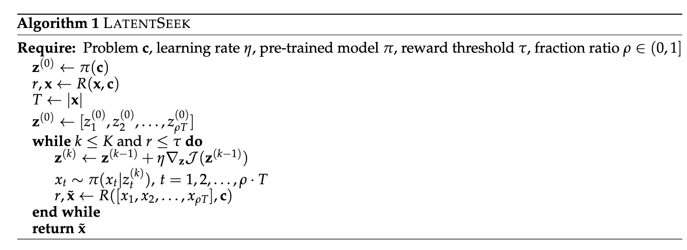
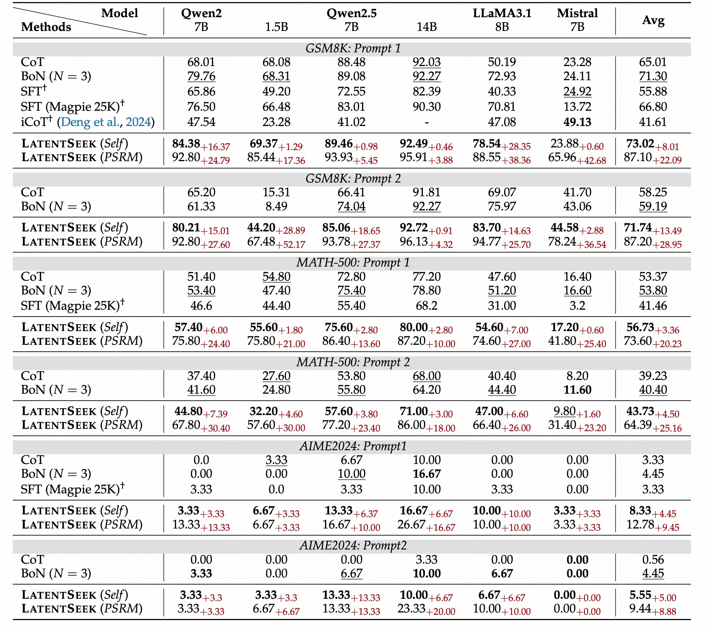
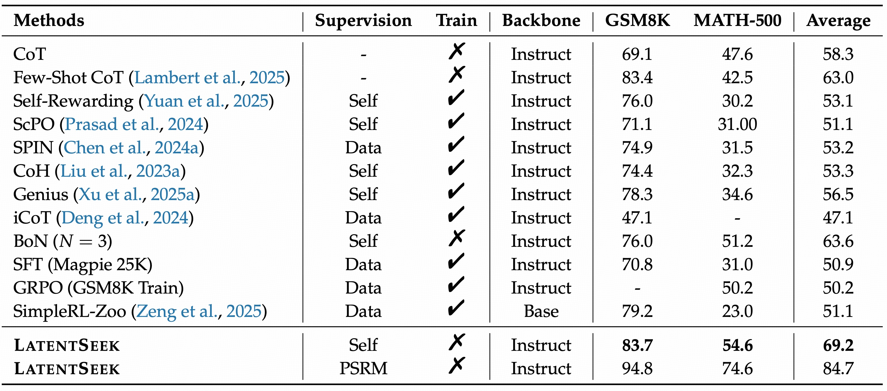
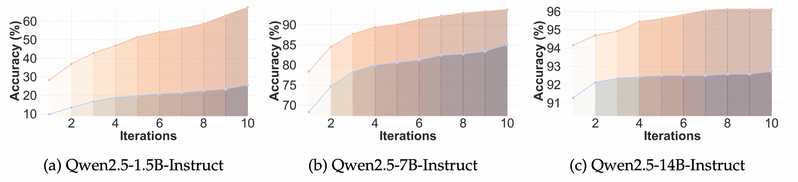

---
​---
layout: default

title: > 
Seek in the Dark: Reasoning via Test-Time Instance-Level Policy Gradient in Latent Space
authors:
    - name: Hengli Li
      tag: <i class="fas fa-star" style='font-size:11px'></i> 1, 2
      url: https://github.com/Henry839
    - name: Chenxi Li
      tag: <i class="fas fa-star" style='font-size:11px'></i> 3
      url: https://wutong4012.github.io/
    - name: Tong Wu
      tag: 2
      url: https://wutong4012.github.io/
    - name: Xuekai Zhu
      tag: 2, 4
      url: https://xuekai-zhu.github.io/Xuekai-Zhu/
    - name: Yuxuan Wang
      tag: 2
      url: https://github.com/patrick-tssn
    - name: Zhaoxin Yu
      tag: 5
      url: https://github.com/patrick-tssn
    - name: Eric Hanchen Jiang
      tag: 6
      url: https://www.ericjiang.info/
    - name: Zixia Jia
      tag: 2
      url: https://scholar.google.com/citations?user=FdwGDyoAAAAJ&hl=zh-CN
    - name: Song-Chun Zhu
      tag: 1,2,3
      url: https://zhusongchun.net/
    - name: Ying Nian Wu
      tag: 6
      url: http://www.stat.ucla.edu/~ywu/
    - name: Zilong Zheng
      url: https://zilongzheng.github.io
      tag: 2, <i class="fa fa-envelope"></i>
affiliations:
    - name: Institute for Artificial Intelligence, Peking University
      tag: 1
    - name: NLCo Lab, Beijing Institute for General Artificial Intelligence
      tag: 2
    - name: Department of Automation, Tsinghua University
      tag: 3
    - name: Shanghai Jiao Tong University 
      tag: 4
    - name: Institute of Automation, Chinese Academy of Sciences 
      tag: 5
    - name: University of California, Los Angeles
      tag: 6
misc: > 
  <sup><i class="fas fa-star" style='font-size:11px'></i></sup> Equal Contribution.
  <sup><i class="fa fa-envelope"></i></sup> Corresponding authors.

arxiv: https://arxiv.org/abs/2502.18890
code: https://github.com/bigai-nlco/LatentSeek
​---
---


LatentSeek is a novel framework that enhances LLM reasoning through **Test-Time Instance-level Adaptation (TTIA)** within the model's **latent space**. Specifically, LatentSeek leverages policy gradient to iteratively update latent representations, guided by self-generated reward signals. 

## TTIA in Latent Space

Given a reasoning problem instance $\mathbf{c}$ as a context prompt, a pre-trained auto-regressive language model $\pi$, a reasoning token sequence $\mathbf{x} = (x_1, x_2, \ldots, x_T)$, and denote the corresponding sequence of latent representations of $\mathbf{x}$ as $\mathbf{z} = (z_1, z_2, z_3, \ldots, z_T)$, the objective is:
$$
\mathbf{z}^* = \arg\max_{\mathbf{z}} \mathbb{E}_{\mathbf{x} \sim \pi(\mathbf{x}|\mathbf{z})}[R(\mathbf{x}, \mathbf{c})].
$$
**Independent Sampling**
$$
\pi(\mathbf{x}|\mathbf{z}) = \prod_{t = 1}^{T} \pi(x_t|z_t), 
$$
**Test-Time Optimization of Latent Representations**

Assuming the *independence of the latent representations*, the test-time optimization is:
$$
\mathbf{z} \leftarrow \mathbf{z} + \eta  \nabla_{\mathbf{z}} \mathcal{J}(\mathbf{z}),
$$
and the gradient is calculated as follows:
$$
[\nabla_{\mathbf{z}} \mathcal{J}(\mathbf{z})]_t = \mathbb{E}_{\mathbf{x} \sim \pi(\mathbf{x}|\mathbf{z})}\left[R(\mathbf{x},\mathbf{c})\nabla_{z_t} \log \pi(x_t|z_t)\right],
$$
where $t$ denotes the position of the latent representation.

## LatentSeek Algorithm


The LatentSeek algorithm is described in Algorithm 1. This algorithm iteratively refines the latent representations based on the rewards of generated reasoning paths, effectively performing a guided search through the reasoning space specific to the given problem instance.  After each refinement step, the latent representations are decoded into tokens to calculate a reward signal. This signal is then employed to direct the search process in the subsequent iteration. Along with the reward signal, the final output $\tilde{\mathbf{x}}$ is also explicitly provided. The process runs for a small number of iterations (typically 2-10), stopping early if the reward exceeds a threshold. 

## Empirical Results

**Reward Models: **

* Self: self-reward
* Perfect Sparse Reward Model (PSRM): A reward value of 0 is assigned exclusively when the generated final answer exactly matches the ground truth. In all other cases, a reward of $-1$ is given.

<h5 align="center">Accuracy on GSM8K, MATH-500, AIME2024 datasets.</h5>



<h5 align="center">Accuracy on GSM8K, MATH-500, AIME2024 datasets.</h5>



* Best Performance on GSM8K, MATH-500, and AIME2024.
* Be able to generalize across backbones.
* Be able to generalize across prompts.
* Smaller models have acquired substantial knowledge but may lack effective mechanisms to elicit them.

**Test-Time Scaling**



* Blue: self-reward; Orange: PSRM 

## BibTex

```bibtex

```
